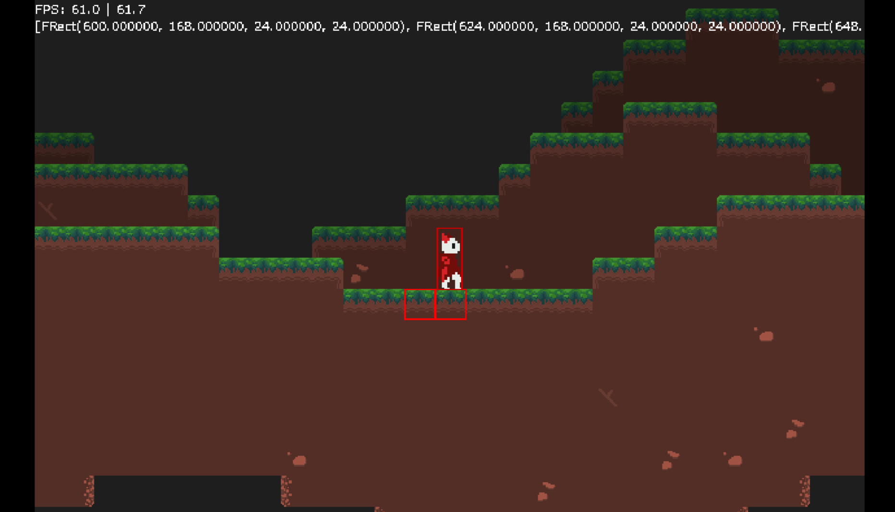
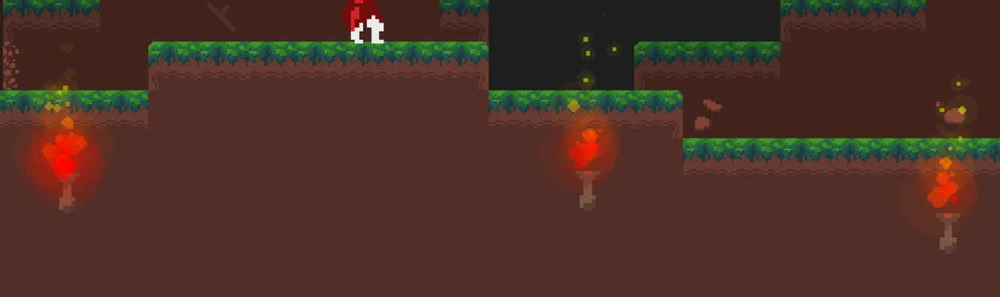
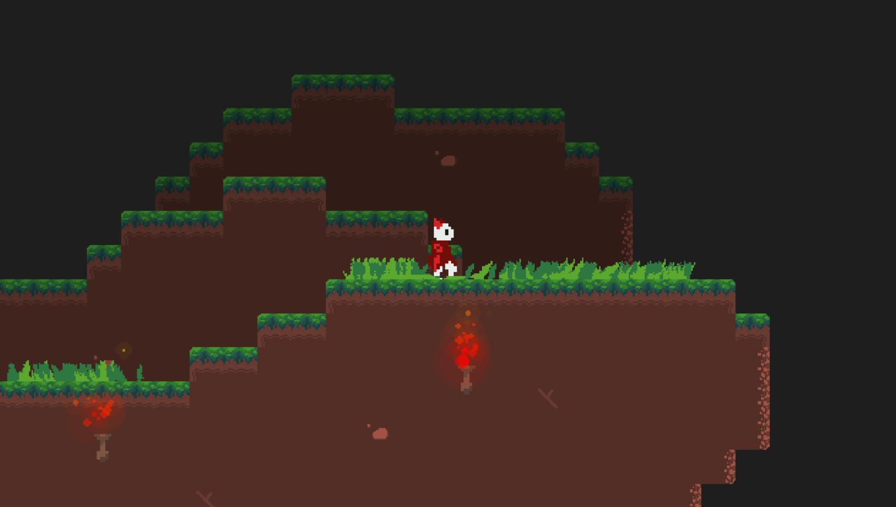

# 19/07/2024 | New Beginnings

Currently, all I'm doing is carrying over code from my first iteration of the game, optimising it as I go from the ground up.

The main focus today is making the tilemap and tile classes, as well as an improved editor, mainly one that can handle layers which the old one couldn't.

## 19/07/2024 | Level Editor

For me, creating levels and worlds is easily the most boring process of gamedev. As such, to make it a bit more bearable, I try to make little "quality of life" stuff. This included this lil tab menu to choose blocks, and particle effects.

https://github.com/user-attachments/assets/7799e17e-2c4e-4f72-8a7b-a7fc58ee757e

I ended up adding auto-tiling with some randomness for certain tiles depending on how you configure it. Ideally, I would want it to be configurable within the GUI but that'll take a lot of effort for something I just need to hardcode in.

https://github.com/user-attachments/assets/a8822beb-c2de-45c3-b374-ea679e95e806

With a basic save and load function, and some darkening to layers further in the background, that should be it for the level editor.

## 20/07/2024 | Offgrid Tiles

Completely forgot about them, but they're added now. Added them to the tab menu too.

# 22/07/2024 | Hello World!

With a bit of struggle, I eventually got the tilemaps generated from the level editor to be compatible with the game. 

From my old version of the game, I've optimised it much more. Rather than blitting every tile on screen every frame, I blitted them once to a "map surface" at the beginning of run time, and use the camera offset to blit a portion of the screen once per frame. 

Works well for now, although I am skeptical I won't run into problems in the future especially for niche collision cases.

# 22/07/2024 | Particles and Touching Grass

Pretty obvious, but I addded a particle system. It's pretty similar to the old implementation, just all of it encased in its own particle manager. I also decided to not split background and foreground particles, rather just using the sprite's "z" value.

For the first particle, I made a simple fire particle for torch sprites. I'll probably also make different ones for slanted torches on the side of walls.

Now, a kryptonite for many programmers - myself included - I've incorporated grass. My old grass looked pretty janky, since there was no interpolation, it just moved from one state to another if the player was nearby. To prevent that, I employed a flawless strategy: Plagiarism.

 This is literally just DaFluffyPotato's grass manager, just modified to work with my assets and stuff. I also added the ability to have different types of grass which will be useful for other levels, different grass types, flowers etc.

